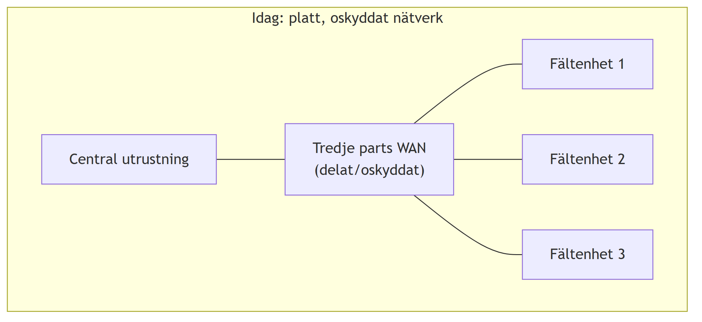
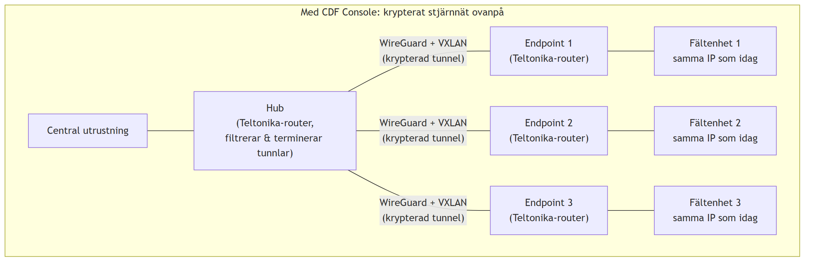
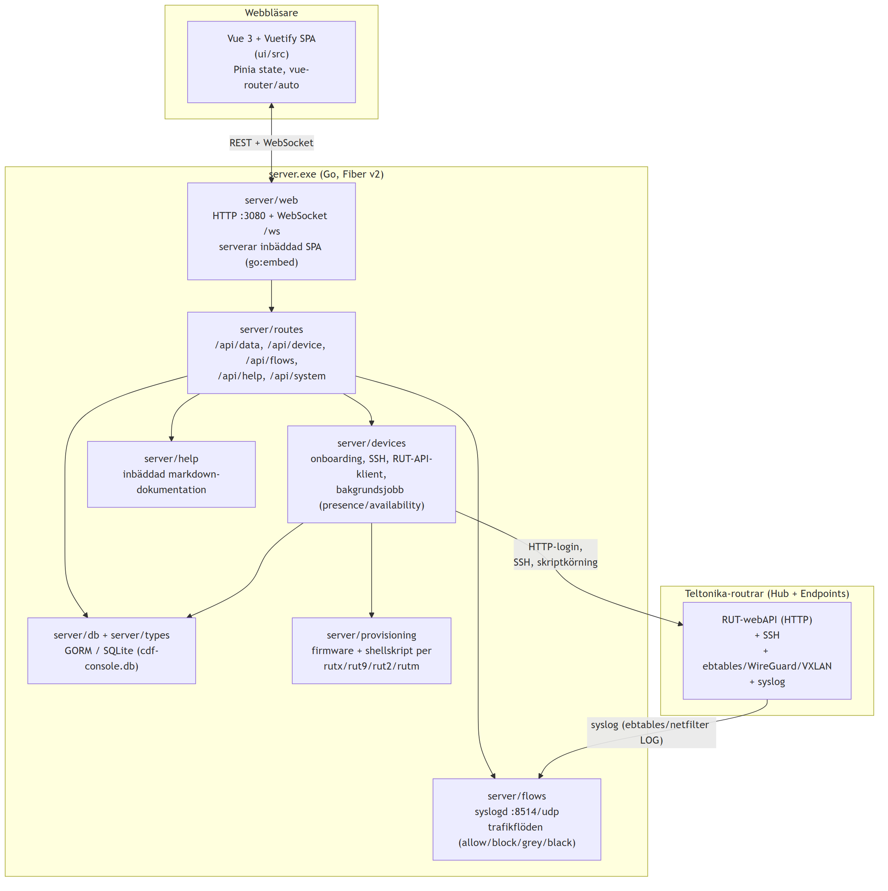
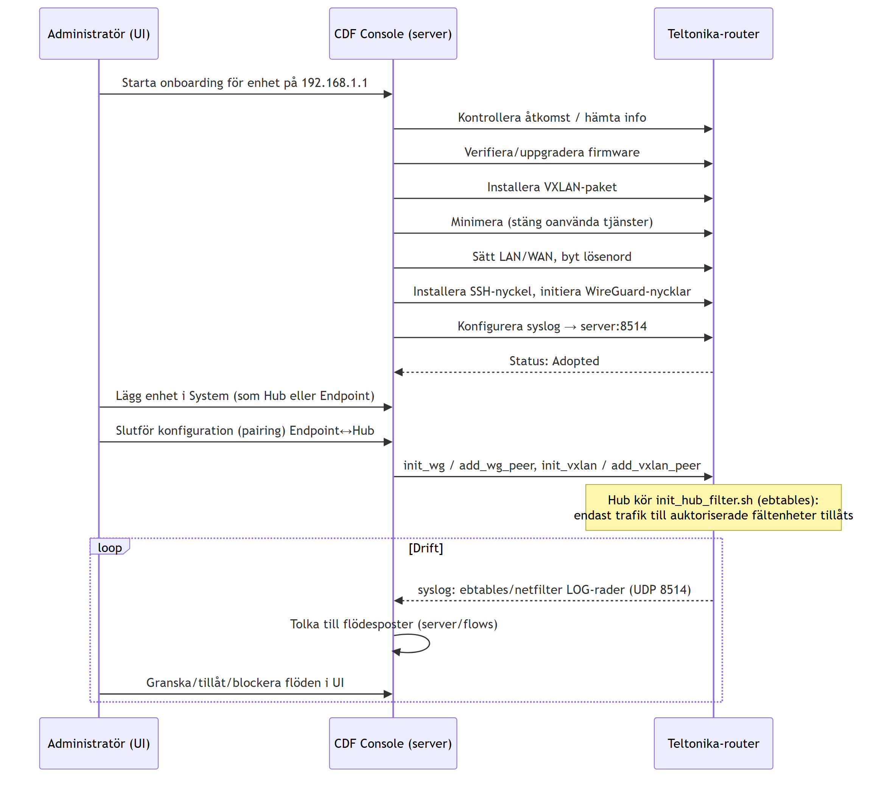

# Controlled Data Flows (CDF) Console

CDF Console är ett verktyg för att lägga ett skyddande, krypterat lager ovanpå befintliga platta OT/SCADA-nätverk — utan att påverka den befintliga adresseringen — genom att styra Teltonika-routrar (RUTX/RUT9/RUT2/RUTM) som mikrosegmenteringspunkter.

Fullständig användardokumentation finns inbyggd i verktyget under **Hjälp** (`server/help/docs/`, se [00-overview.md](server/help/docs/00-overview.md)). Det här dokumentet beskriver lösningen ur ett tekniskt/arkitektur-perspektiv för utvecklare.

## Innehåll

- [Syfte](#syfte)
- [Översiktlig funktion](#översiktlig-funktion)
- [Hur det är implementerat](#hur-det-är-implementerat)
- [Katalogstruktur](#katalogstruktur)
- [Ordlista](#ordlista)
- [Vidare läsning](#vidare-läsning)

## Syfte

Mindre OT-system (t.ex. SCADA/styrsystem för anläggningar utspridda geografiskt) har ofta ett eller flera platta, oskyddade nätverk som binds ihop av en tredje parts kommunikationsinfrastruktur (t.ex. mobilt WAN). Det ger två återkommande sårbarheter:

1. **Fysisk åtkomst på en fältplats ger nätverksåtkomst överallt** — eftersom nätverket är platt kan den som får tillträde till en enda fältnod nå både centralt system och alla andra fältnoder.
2. **Tredjepartsinfrastrukturen kan användas för att komma åt eller störa den oskyddade trafiken**, eftersom kommunikationen mellan platserna inte är krypterad eller autentiserad på nätverksnivå.

CDF Console löser detta genom att sätta in en Teltonika-router vid varje anslutningspunkt — en central **Hub** och flera **Endpoints** i fält — som tillsammans bygger upp ett krypterat, stjärnformat nätverk ovanpå det befintliga. Den befintliga IP-adresseringen på fältenheterna (t.ex. PLC:er, RTU:er) påverkas inte.

## Översiktlig funktion

### Från platt till skyddat stjärnnät

<!--
Diagramkälla (Mermaid), render om vid ändring, se docs/diagrams/README.md:

graph TB
    subgraph Idag["Idag: platt, oskyddat nätverk"]
        A1[Central utrustning] --- W1["Tredje parts WAN\n(delat/oskyddat)"]
        W1 --- F1[Fältenhet 1]
        W1 --- F2[Fältenhet 2]
        W1 --- F3[Fältenhet 3]
    end
-->



<!--
Diagramkälla (Mermaid), render om vid ändring, se docs/diagrams/README.md:

graph TB
    subgraph Med_CDF["Med CDF Console: krypterat stjärnnät ovanpå"]
        C[Central utrustning] --- H["Hub\n(Teltonika-router,\nfiltrerar & terminerar tunnlar)"]
        H -- "WireGuard + VXLAN\n(krypterad tunnel)" --- E1["Endpoint 1\n(Teltonika-router)"]
        H -- "WireGuard + VXLAN\n(krypterad tunnel)" --- E2["Endpoint 2\n(Teltonika-router)"]
        H -- "WireGuard + VXLAN\n(krypterad tunnel)" --- E3["Endpoint 3\n(Teltonika-router)"]
        E1 --- F1[Fältenhet 1\nsamma IP som idag]
        E2 --- F2[Fältenhet 2\nsamma IP som idag]
        E3 --- F3[Fältenhet 3\nsamma IP som idag]
    end
-->



Hub:en terminerar samtliga tunnlar och filtrerar trafiken (ebtables på L2) så att endast trafik avsedd för respektive fältenhet släpps igenom — övrig trafik blockeras. Den ursprungliga adresseringen bevaras genom att routerns LAN-nät speglar fältenhetens befintliga nät (t.ex. OT-enhet `172.16.91.34/22` → router-LAN `192.168.91.x/22`), medan en separat, fristående WAN-adressering (t.ex. `10.49.x.x/22`) används för själva tunnelöverlägget.

### Begrepp i modellen

| Begrepp | Betydelse |
|---|---|
| **System** | En namngiven samling enheter (Devices) som tillsammans utgör ett skyddat nätverk. |
| **Device** | En fysisk Teltonika-router. Går igenom **Onboarding** innan den kan användas. |
| **Hub** | En Device med rollen central nod i ett System — terminerar tunnlar, filtrerar trafik. |
| **Endpoint** | En Device med rollen fältnod i ett System — tunnlar tillbaka till sin Hub. |
| **Onboarding** | Processen att ta en fabriksny/nollställd router från okänt till driftklart (`Adopted`) skick. |
| **Pairing** | Att koppla ihop en Endpoint med sin Hub: konfigurerar WireGuard/VXLAN, syslog och NTP på båda sidor. |

Applikationen exponerar konsollen för administratören som ska sätta upp och underhålla dessa System, medan de faktiska routrarna sköter kryptering och filtrering i drift, oberoende av konsollen.

## Hur det är implementerat

CDF Console består av en Go-backend (`server/`) som bäddar in en Vue/Vuetify-frontend (`ui/`) och styr Teltonika-routrarna via deras HTTP-API och SSH — plus provisioneringsskript som körs på routrarna.

### Komponentöversikt

<!--
Diagramkälla (Mermaid), render om vid ändring, se docs/diagrams/README.md:

graph TB
    subgraph Browser["Webbläsare"]
        UI["Vue 3 + Vuetify SPA\n(ui/src)\nPinia state, vue-router/auto"]
    end

    subgraph ServerBin["server.exe (Go, Fiber v2)"]
        WEB["server/web\nHTTP :3080 + WebSocket /ws\nserverar inbäddad SPA (go:embed)"]
        ROUTES["server/routes\n/api/data, /api/device, /api/flows,\n/api/help, /api/system"]
        DEVICES["server/devices\nonboarding, SSH, RUT-API-klient,\nbakgrundsjobb (presence/availability)"]
        FLOWS["server/flows\nsyslogd :8514/udp\ntrafikflöden (allow/block/grey/black)"]
        HELP["server/help\ninbäddad markdown-dokumentation"]
        DB["server/db + server/types\nGORM / SQLite (cdf-console.db)"]
        PROV["server/provisioning\nfirmware + shellskript per\nrutx/rut9/rut2/rutm"]
    end

    subgraph Routers["Teltonika-routrar (Hub + Endpoints)"]
        RUT["RUT-webAPI (HTTP)\n+ SSH\n+ ebtables/WireGuard/VXLAN\n+ syslog"]
    end

    UI <-- "REST + WebSocket" --> WEB
    WEB --> ROUTES
    ROUTES --> DEVICES
    ROUTES --> FLOWS
    ROUTES --> HELP
    ROUTES --> DB
    DEVICES --> DB
    DEVICES -- "HTTP-login,\nSSH, skriptkörning" --> RUT
    DEVICES --> PROV
    RUT -- "syslog (ebtables/netfilter LOG)" --> FLOWS
-->



### Backend (`server/`)

- **Ramverk**: [Fiber v2](https://gofiber.io/) (`server/web/server.go`), lyssnar på port `3080`. Den kompilerade Vue-SPA:n bäddas in i binären med `go:embed` och serveras direkt av Go-processen — ingen separat webbserver behövs i drift.
- **API**: registreras centralt i `server/routes/register.go`. Huvudgrupper:
  - `server/routes/data.go` — generisk, reflektionsbaserad CRUD (`/api/data/:type`) mot alla registrerade GORM-typer (System, Device, Network, m.fl.), se `server/types/registry.go`.
  - `server/routes/device.go` — enhetshantering: närvaro/serie-uppslag, firmware (lista/uppgradera), VXLAN-installation, SSH-nycklar, fjärrskal/skript, backup, SSH-sessionshantering.
  - `server/routes/flows.go` — trafikflödeslistor (`white/allow`, `white/block`, `grey`, `black`) och EtherType-referens.
  - `server/routes/help.go` — serverar den inbäddade hjälpdokumentationen (struktur, innehåll, bilder).
  - `server/routes/system.go` — versions-/build-info för UI:t.
- **Enhetslagret** (`server/devices/`) pratar med routrarna på två vägar: Teltonika RUT-webbens JSON-API (inloggning, enhetsinfo — se `server/messages/teltonika.go`) och SSH (fjärrskript, statistikinsamling). Här ligger också **onboarding**-arbetsflödet (`onboarding.go`): åtkomsttest → firmware-val/uppgradering → VXLAN-paket → "minimera" (stänger onödiga tjänster) → LAN/WAN-konfiguration → lösenordsbyte → SSH-nyckel → WireGuard-init → syslog-konfiguration → status `Adopted`. Två bakgrundsjobb (`workers.go`) pollar kontinuerligt efter fabriksnollställda enheter respektive tillgänglighet på kända enheter.
- **Flödeslagret** (`server/flows/`) har två delar: dels en `syslogd` (UDP `:8514`) som tar emot och parsar ebtables/netfilter-loggrader från routrarnas filter och bygger en observerad flödeslogg, dels de persisterade tillåt-/blockeringslistor (`DataFlow`/`DataFlowList`) som styr vad Hub-filtret faktiskt släpper igenom.
- **Provisionering** (`server/provisioning/`) håller firmware-avbildningar och de shellskript som via SSH sätter upp respektive router: `init_hub_filter.sh` (ebtables-filtrering på Hub), `init_wg*.sh`/`add_wg_peer.sh` (WireGuard), `init_vxlan.sh`/`add_vxlan_peer.sh` (VXLAN-overlay), `init_syslog.sh`, `init_ntpclient/server.sh`, `set_lan_wan.sh`, `change_password.sh`, `minimize.sh`.
- **Lagring**: SQLite via GORM (`server/db/`), automigrering av domäntyperna i `server/types/` (System, Device, Network, Address, WireguardInstance/Peer, DataFlow/DataFlowList, mallar för nätverk/hub/endpoint, User, Settings, Log, m.fl.).
- **Inbäddad hjälp** (`server/help/`) exponerar markdown-filerna i `server/help/docs/` (inklusive bilder) via API:t, samma innehåll som renderas i UI:t och kan exporteras till PDF.

### Frontend (`ui/`)

- **Vue 3 + Vuetify 3**, byggt med Vite. Filbaserad routing via `vue-router/auto` mot `ui/src/pages/**`, layouter via `vite-plugin-vue-layouts` (`ui/src/layouts/`).
- **State**: Pinia (`ui/src/stores/app.js`) — global alert/snackbar-hantering samt vald System/Device-kontext, persisterad i webbläsaren.
- **Huvudsidor** (`ui/src/pages/ui/`): dashboard (`index.vue` — kortöversikt över alla enheter med status och trafikräknare, autouppdatering var 30:e sekund), `onboarding.vue` (guide för att ta in nya enheter), `systems/` (skapa/redigera System), `device/hub.vue` & `device/endpoint.vue` (rolls-specifika detaljvyer), `networks.vue`, `templates.vue`, `monitoring/`.
- **Hjälpvy** (`ui/src/pages/help.vue`) renderar den inbäddade markdown-dokumentationen och stödjer PDF-export.
- Kommunicerar med backend via REST (`/api/...`) och en WebSocket (`/ws`) för liveuppdateringar.

### Onboarding- och trafikflöde (sekvens)

<!--
Diagramkälla (Mermaid), render om vid ändring, se docs/diagrams/README.md:

sequenceDiagram
    participant Op as Administratör (UI)
    participant Srv as CDF Console (server)
    participant Rtr as Teltonika-router

    Op->>Srv: Starta onboarding för enhet på 192.168.1.1
    Srv->>Rtr: Kontrollera åtkomst / hämta info
    Srv->>Rtr: Verifiera/uppgradera firmware
    Srv->>Rtr: Installera VXLAN-paket
    Srv->>Rtr: Minimera (stäng oanvända tjänster)
    Srv->>Rtr: Sätt LAN/WAN, byt lösenord
    Srv->>Rtr: Installera SSH-nyckel, initiera WireGuard-nycklar
    Srv->>Rtr: Konfigurera syslog → server:8514
    Rtr-->>Srv: Status: Adopted
    Op->>Srv: Lägg enhet i System (som Hub eller Endpoint)
    Op->>Srv: Slutför konfiguration (pairing) Endpoint↔Hub
    Srv->>Rtr: init_wg / add_wg_peer, init_vxlan / add_vxlan_peer
    Note over Rtr: Hub kör init_hub_filter.sh (ebtables):<br/>endast trafik till auktoriserade fältenheter tillåts

    loop Drift
        Rtr-->>Srv: syslog: ebtables/netfilter LOG-rader (UDP 8514)
        Srv->>Srv: Tolka till flödesposter (server/flows)
        Op->>Srv: Granska/tillåt/blockera flöden i UI
    end
-->



## Katalogstruktur

```
src/
├── server/                Go-backend
│   ├── main.go             Startpunkt: DB, bakgrundsjobb, webbserver
│   ├── web/                Fiber-server, inbäddad SPA, WebSocket
│   ├── routes/              HTTP-API
│   ├── devices/              Enhetsstyrning: RUT-API, SSH, onboarding, bakgrundsjobb
│   ├── flows/                Trafikflöden: syslogd, allow/block-listor
│   ├── provisioning/         Firmware + shellskript per routermodell
│   ├── db/, types/            Datalager (GORM/SQLite) och domäntyper
│   ├── messages/               DTO:er för Teltonika RUT-API och SSH-kommandon
│   ├── help/                   Inbäddad hjälpdokumentation (docs/, denna källa)
│   ├── backup/                  Lagring av enhetsbackuper
│   └── logger/                   Central loggning
└── ui/                      Vue 3 + Vuetify frontend
    └── src/
        ├── pages/            Sidor (filbaserad routing)
        ├── layouts/           Sidlayouter
        ├── components/         Återanvändbara komponenter
        └── stores/              Pinia state
```

## Ordlista

| Term | Betydelse |
|---|---|
| System | Namngiven samling enheter som bildar ett skyddat nätverk |
| Device | Fysisk Teltonika-router (RUTX/RUT9/RUT2/RUTM) |
| Hub | Device med central roll i ett System |
| Endpoint | Device med fältroll i ett System, kopplad till en Hub |
| Onboarding | Process för att göra en ny/nollställd router driftklar (`Adopted`) |
| Pairing | Slutkonfiguration som binder ihop en Endpoint med sin Hub |
| Flow (flöde) | Observerad eller policybestämd nätverkstrafik, klassad som allow/block/grey/black |
| WireGuard | VPN-teknik som används för de krypterade tunnlarna Hub↔Endpoint |
| VXLAN | Overlay-teknik som används tillsammans med WireGuard för tunnlarna |
| ebtables | L2-brandvägg på Hub som filtrerar trafik mellan Endpoints |

## Vidare läsning

Den fullständiga, i verktyget inbäddade användardokumentationen finns i [`server/help/docs/`](server/help/docs/), bland annat:

- [00-overview.md](server/help/docs/00-overview.md) — introduktion för slutanvändare
- [01-new-system.md](server/help/docs/01-new-system.md) — lägga till ett nytt System
- [02-new-hub.md](server/help/docs/02-new-hub.md) — lägga till en ny Hub
- [03-new-endpoint.md](server/help/docs/03-new-endpoint.md) — lägga till en ny Endpoint
- [05-onboarding.md](server/help/docs/05-onboarding.md) — detaljerad onboarding-process
- [95-troubleshooting.md](server/help/docs/95-troubleshooting.md) — felsökning
