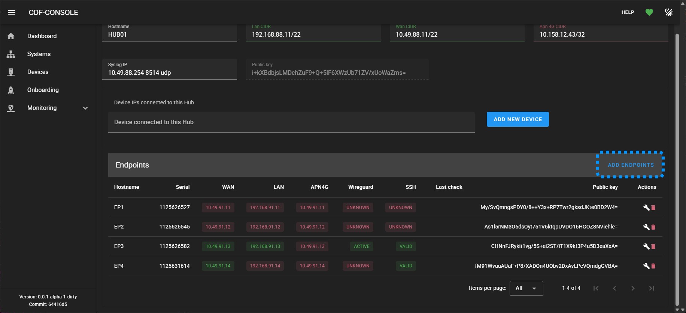
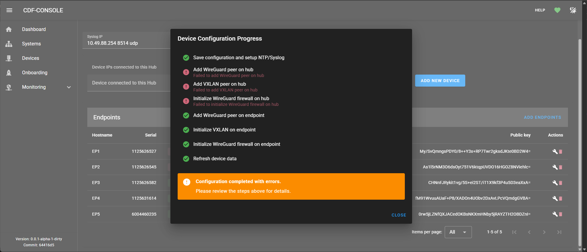

# Lägg till ny endpoint

Detta avsnitt handlar om hur man lägger till en ny endpoint till ett befintlig hub genom att följa dessa steg:

1. [Onboarding av endpoint](#onboarding-av-endpoint)
1. [Koppla endpoint till system](#koppla-endpoit-till-hub)
1. [Slutför konfiguration av ny endpoint](#slutför-konfiguration-av-ny-endpoint)

Om det inte redan finns en avsedd hub för denna endpoint är det fördelaktigt att ha gjort det först för att kunna följa alla steg från början till slut, men det är valfritt hur man vill göra.

## Onboarding av endpoint

Onboarding fungerar lika oavsett om det är en endpoint eller hub man vill lägga till. Man väljer vilken roll man vill att enheten, men det går att ändra den efter onboardingen är klar.

Följ instruktionerna här: [Onboarding av ny enhet](#onboarding-process)

## Para ihop endpoint med hub

Efter att onboardingen är klar så lägger man till enpointen till den hub den skall höra till. Man når hubben antingen genom "Device" listan, eller via "Systems" där man måste välja det system som hubben tillhör.

 

1. Klicka på "ADD ENDPOINT" för att få upp listan över tillgängliga endpoints.

1. Kryssa i de endpoints som skall läggas till och klicka sedan på "ADD ENDPOINT" i denna dialog för att komma tillbaka till hubb-vyn.

1. I hubb-vyn finns nu den nya endpointen med i listan.

## Slutför konfiguration av ny endpoint

Till sist behöver man initiera den faktiska parningen av enheterna för att Wireguard/VXLAN, syslog och NTP skall sättas upp korrekt.

1. Klicka på skiftnyckeln till höger för den endpoint som precis lagts till. Om fler lagts till får man klicka på skiftnyckeln en i taget.

1. Under konfigurationsprocessen försöker verktyget kontakt både hub och endpoint för att para ihop dem, och om verktyget kan nå båda kommer konfigurationen att lyckas. Om bara en av hub eller endpoint är åtkomlig får man felmeddelande för den enhet verktygen inte kommer åt, och då behöver man:
    - Ändra anslutningen till datorn som verktyget går i så att den kan komma åt den andra enheten.
    - Klicka på skiftnyckeln igen för den enhet som inte blev helt klar. Då kommer man få felmeddelanden för den enhet man konfigurerade först istället.
    - Verktyget och den enhet man konfigurerade först kommer ihåg att den är konfigurerad, så när den andra konfigurationen är klar så är båda enhetern klara, även om man fått felmeddelanden.

 *Exempel på felmeddelande när hubben inte är åtkomlig vid konfigurationstillfället*.