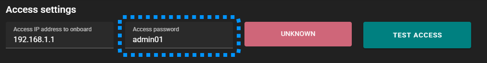
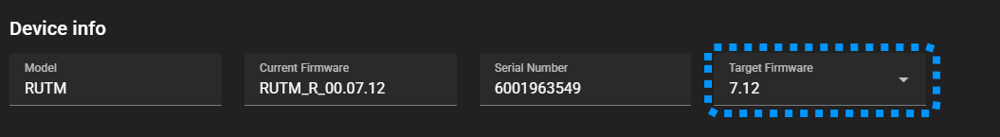
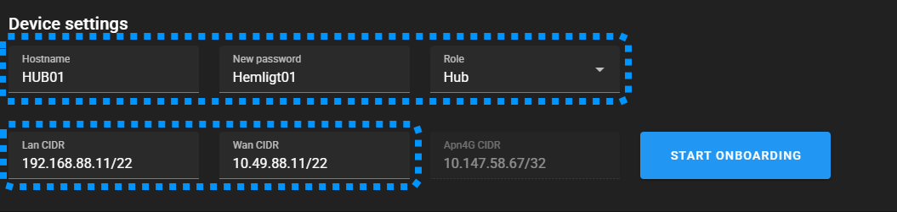
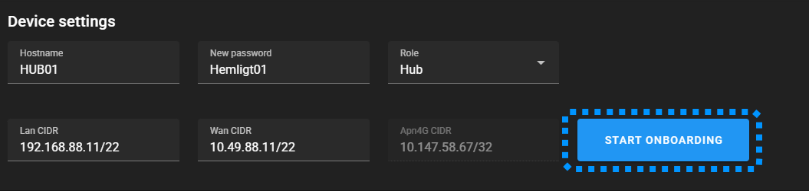
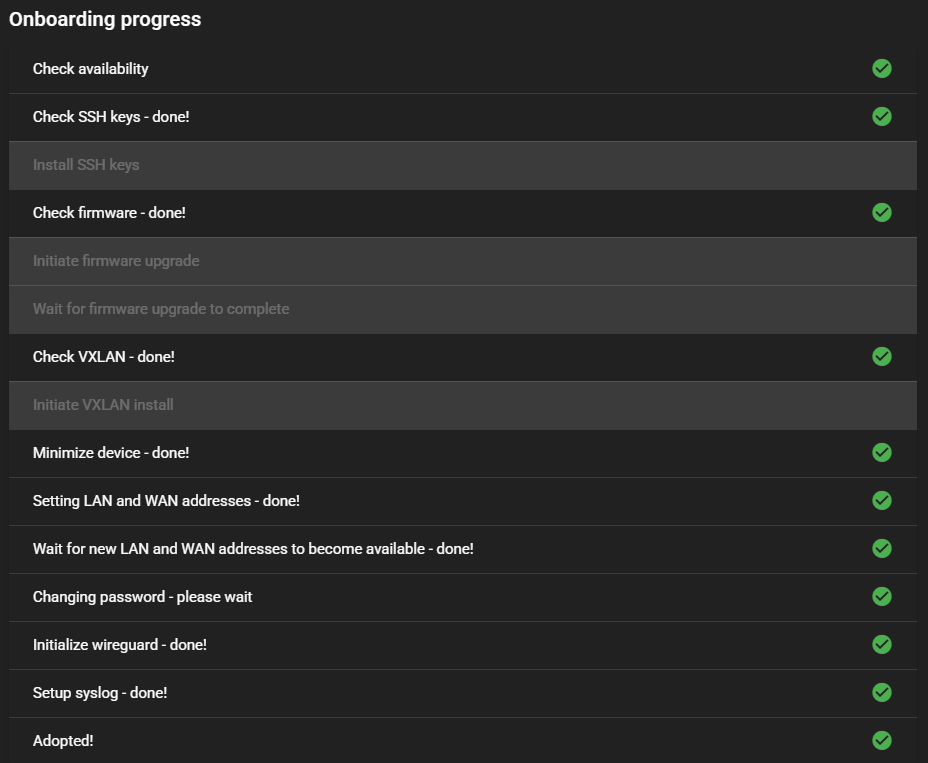

# Onboarding

Detta avsnitt handlar om hur man hanterar helt nya enheter eller återställer befintliga (om något råkat gå fel på vägen), och innehåller de första stegen som behöver göras för en ny enhet för att den ska få rätt grundinställningar och programvara.

1. [Förberedelser](#förberedelser)
1. [Genomförande](#genomförande)
1. [Efter lyckad onboarding](#efter-lyckad-onboarding)

>**I denna version sätts även LAN och WAN IP-adresserna/nätmask vid onboardingen vilket är viktigt att det blir rätt för att man ska slippa göra om det**.

## Förberedelser

Innan man påbörjar detta steg behöver man ha följande tillgängligt innan man kan påbörja processen:

1. Enhetens fabrikslösenord. Det står normalt på ena sidan av enheten.
1. De sista två fälten i IP-adressen för den huvudsakliga enhet (PLC,CPU,Sultzer,I/O, osv) som skall anslutas, exempelvis **```91.34```** taget ur 172.16.91.34
1. Nätmasken för enheten som skall anslutas, exempelvis **```22```**
1. Ett namn som är representativt för platsen, exempelvis **```SPU134```**
1. Det lösenord man vill skall sättas för admin/root kontot, exempelvis ett som lagrats på en YubiKey

Man behöver dessutom ha förberett datorn som verktyget körs i:
1. Säkerställ att datorns nätverksanslutning är konfigurerad så att den kan nå de LAN och WAN nätverk som skall konfigureras på enheten. **Om** man glömmer detta kommer onboarding processen stanna på steget där fastna på ett av stegen, vilket beskrivs närmare under [Oboarding process](#onboarding-process).
1. Anslut en LAN port på enheten som skall onboardas till ett nätverk som detta verktyg har åtkomst till, exempelvis genom en direktanslutning mellan dator och enhet.


## Genomförande

När datorns nätverk är konfigurerade och enheten är ansluten via en av dess LAN portar skall följande steg utföras i ordning:

1. **Access settings** - Anslutningsinställningar ställs in och testas
1. **Device info** - Val av firmware    
1. **Device settings** - Enhetens inställningar fylls i    
1. **Start onboarding** - När alla fält har rätt värden klickar man på "Start onboarding" för att påbörja processen. Aktuell aktivitet samt resultat visa i listan "Onboarding process" efterhand den arbetar.
1. **Adopted** - En lyckad onboarding indikeras med att sista steget i onboarding processen, Adopted, resulterar i grön markering.
1. Nu är enheten redo att läggas till ett [system](./01-new-system.md)!

---
### 1. Access settings

Detta avsnitt ser till att det finns en fungerande nätverksanslutning till enheten som skall onboardas. Vid lyckad anslutning hämtas information från enheten som fylls i de senare avsnitten för att det skall bli enklare.



Nya enheter har normalt ip-adressen **```192.168.1.1```** från fabrik och behöver inte ändras. Är det en befintlig enhet som man vill köra om processen för har den förmodligen redan en annan LAN adress som då skall fyllas i här istället.

1. Kontrollera så att "Access IP address to onboard" är korrekt
1. Fyll i enhetens lösenord (markerad med blå inramning i bilen ovan), vilket för Teltonika står på sidan av enheten
1. Klicka "Test access" för att kontrollera anslutningen. Det röda fältet ändras inom ett par sekunder från ```UNKNOWN``` till något av:
    - ```NOT REACHABLE``` - Indikerar att adressen **inte är åtkomlig** från den dator som verktyget körs i.  Kontrollera att det är möjligt att nå enheten, exempelvis med hjälp av ping: **```ping 192.168.1.1```** (eller den adressen som står i första fältet)
    - ```TESTING, PLEASE WAIT!``` - Om lösenordet är felaktigt blir tyvärr man tyvärr hängandes (mer än ett par sekunder) med detta meddelande. Kontrollera  lösenordet och testa igen.
    - ```DEVICE FOUND``` - Om man lyckas ansluta till enheten får man detta meddelande och fälten i avsnitten "Device info" och "Device settings" fylls i. Dags att fortsätta med nästa avsnitt.
1. Gå vidare till nästa steg

---
### 2. Device info



1. Välj den senaste firmware som är tillgänglig för modellen
1. Gå vidare till nästa steg

---
### 3. Device settings

Om det är en befintlig enhet som skall onboardas på nytt kommer enhetens konfigurationer att dyka upp här. För nya enheter har fälten standardvärden som behöver ändras till de som enheten skall ha.



1. Fyll i fälten som  är markerade på blå inramning i bilden ovan:
    - ```Hostname``` - Förslagsvis något som är relaterat till platsen där enheten skall placeras, såsom exempelvis: ```SPU134```
    - ```New password``` - Det lösenord ni valt för admin/root kontot på dessa enheter, förslagvis sparat på en Yubikey
    - ```Role``` - Välj ```Hub``` för nya nätverk där enheten skall fungera som central instans för alla Wireguard-anslutningar (typiskt placerade centralt), och ```Endpoint``` för alla enheter som skall placeras i fält.
    - ```LAN CIDR``` - Förslagsvis enligt mönstret: ```192.168.A.B/22```, där ```A.B``` är samma för WAN och är registrerat i katalogen över nätverksadresser. Kan fördelaktigt sammanfalla med adressen som ansluten OT tilgång har, exempelvis: ```172.16.91.23/22 -> 192.168.91.23/22```)
    - ```WAN CIDR``` - Förslagsvis enligt mönstret: ```10.49.A.B/22```, där ```A.B``` är samma för LAN, exempelvis: ```192.168.91.23/22 -> 10.49.91.23/22```
    - Nätmasken bör vara densamma som OT tillgångens nätmask, det måste inte vara **22**!
    - **OBS!** Det är viktigt att IP-adresser och nätmask för LAN och WAN blir rätt för att man ska slippa göra om onboardingen. Om man inte upptäcker det direkt kan det leda till svårhittade problem efter man lagt till enheten til ett system.
    - Fältet ```Apn4G CIDR``` fylls endast i om enheten har ett 4G modem med ett aktiverat SIM kort och visar då den IP-adress som tilldelats SIM kortet.
1. Gå vidare till nästa steg


## Onboarding process

Verktyget utför automatiskt alla steg men avbryter processen om ett fel upptäcks. Vissa kontroller, såsom om rätt firmware är installerat kan ge en orange varning  vilket betyder att steget efter måste genomföras. Om steget resulterar i en grön markering  så hoppar den över nästa steg för att undvika tidskrävande åtgärder som inte är nödvändiga, exempelvis som att installera om samma firmware version som redan är installerad.




Påbörja processen genom att klicka på ```START ONBOARDING``` markerad i blå inramning i bilden ovan.



1. **Check Accessibility** - Kontrollerar ännu en gång att enheten är nåbar via nätverket.
1. **Install SSH Key** - Installerar SSH nycklar för enklare åtkomst vid konfiguration och felsökning.
1. **Check firmware** - Kontrollerar om vald firmware version redan är installerad. Ger en orange resultatindikering om det är fel version som är installerad.
1. **Install firmware upgrade** - Uppladdning och installation av vald firmware version. Aktiveras endast om steget innan ger orange varning.
1. **Wait for firmware upgrade to complete** - Efter firmware har installerats bootar enheten om. Detta steg är endast till för att vänta tills enheten är redo att fortsätta efter ombootningen och aktiveras endast tillsammans med steget innan.
1. **Check VXLAN** - Kontrollerar om VXLAN paketet är installerat. Resulterar i en orange varning om det inte är installerat.
1. **Initiate VXLAN install** - Laddar upp och installation av VXLAN paketet
1. **Minimize device** - Konfigurerar bort tjänster som inte används och sätter upp brandväggen
1. **Setting LAN and WAN addresses** - Konfigurerar LAN och WAN. Om dessa blir fel eller om man inte konfigurerat datorns nätverk rätt blir man hängande i nästa steg.
1. **Wait for LAN and WAN addresses to become available** - Detta steg väntar helt enkelt på att LAN och WAN skall bli åtkomliga och börjar om steget om timern löper ut innan enheten är åtkomlig igen. Om man glömt konfigurera nätverken rätt på datorn blir man hängandes här. Det åtgärdar man genom att låta onboardingen fortsätta (hängandes här) och lägga till datorn till LAN och/eller WAN. Efter det kommer onboarding processen att gå vidare.
1. **Changing password** - Ändrar enhetens admin/root lösenord till det som angivits i "Device settings". Om inget lösenord angetts ändras det inte i enheten.
1. **Initialize WireGuard** - Sätter upp nycklar och den lokala instansen. Peers läggs till i ett annat moment där enheten läggs till ett system och konfigureras mot dess hubb.
1. **Setup syslog** - Konfigurerar syslog att skicka loggarna till angiven syslog server (vilket just nu inte finns något fält för, så det är tveksamt om detta fungerar i denna version)
1. **Adopted** - Om det blir en grön markering efter denna aktivitet har processen gått bra och enheten är redo att läggas till ett system.


## Efter lyckad onboarding

Nu är enheten redo att läggas till ett system för slutlig konfiguration och driftsättning. Beroende på om den är tänkt att vara en Hub eller Endpoint följer du någon av följande instruktioner:

- [Lägg till ny hub](./02-new-hub.md)
- [Lägg till ny endpoint](./03-new-endpoint.md)
